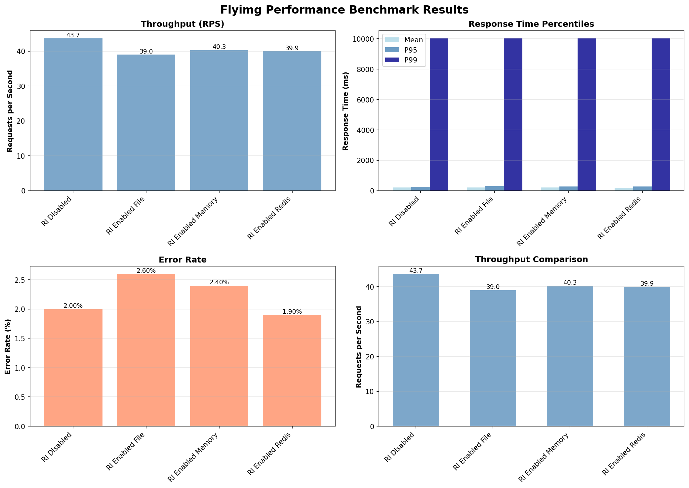

# Performance Benchmarking Script

This script allows you to benchmark Flyimg performance and collect comprehensive performance metrics. You manually configure the `parameters.yml` file with your desired settings (cache enabled/disabled, rate limiting enabled/disabled) before running each benchmark.

## Features

- Run benchmarks with custom configuration names
- Collects comprehensive metrics:
  - Requests per second (RPS)
  - Response times (mean, min, max, p50, p95, p99)
  - Error rates
  - Status code distribution
- Works with local containers or remote URLs
- Automatically updates and restores configuration
- Outputs results in JSON format for easy visualization

## Installation

### Quick Setup (Recommended)

Use the provided setup script:

```bash
./setup_benchmark_env.sh
```

This will create a virtual environment (`benchmark_venv`) and install all dependencies.

### Manual Setup

#### Option 1: Using pip (for systems without externally-managed Python)

```bash
pip install -r benchmark_requirements.txt
```

Or install manually:

```bash
pip install requests pyyaml matplotlib numpy
```

#### Option 2: For externally-managed Python environments (Homebrew, macOS, etc.)

If you get an "externally-managed-environment" error, use a virtual environment:

```bash
# Create virtual environment
python3 -m venv benchmark_venv

# Activate it (on macOS/Linux)
source benchmark_venv/bin/activate

# Install dependencies
pip install -r benchmark_requirements.txt
```

**Important:** If you use a virtual environment, you must activate it before running the benchmark scripts:

```bash
source benchmark_venv/bin/activate
python benchmark_performance.py --config-name my_config --container-name flyimg
```

## Usage

### Step 1: Configure parameters.yml

Before running the benchmark, manually edit `config/parameters.yml` (or the config file in your container) to set your desired configuration:

- Set `disable_cache: false` to enable cache, or `disable_cache: true` to disable it
- Set `rate_limit_enabled: true` to enable rate limiting, or `rate_limit_enabled: false` to disable it

### Step 2: Run the Benchmark

#### Testing a Local Docker Container

If you have a Flyimg container running:

```bash
python benchmark_performance.py \
  --config-name cache_enabled_rl_disabled \
  --container-name flyimg \
  --port 8080
```

#### Testing a Remote URL

If you want to test a remote Flyimg instance:

```bash
python benchmark_performance.py \
  --config-name cache_enabled_rl_disabled \
  --url http://your-flyimg-instance.com
```

#### Testing with Custom Parameters

```bash
python benchmark_performance.py \
  --config-name my_custom_config \
  --container-name flyimg \
  --port 8080 \
  --test-image Rovinj-Croatia.jpg \
  --num-requests 2000 \
  --concurrency 20 \
  --output my_benchmark_results.json
```

### Running Multiple Configurations

To test different configurations, you need to:

1. Configure `parameters.yml` with your first configuration
2. Run the benchmark with a config name:
   ```bash
   python benchmark_performance.py --config-name config1 --container-name flyimg
   ```
3. Change `parameters.yml` to your second configuration
4. Run the benchmark again with a different config name:
   ```bash
   python benchmark_performance.py --config-name config2 --container-name flyimg
   ```
5. Repeat for all configurations you want to test

The results will be appended to the same JSON file (or use `--output` to use different files).

### Command Line Options

- `--config-name NAME`: **Required.** Configuration name/identifier for this benchmark run (e.g., `cache_enabled_rl_disabled`)
- `--url URL`: Base URL of Flyimg instance (e.g., `http://localhost:8099`)
- `--container-name NAME`: Docker container name (alternative to `--url`)
- `--port PORT`: Port number (default: 80, used with `--container-name`)
- `--test-image PATH`: Test image path relative to web/ directory (default: `Rovinj-Croatia.jpg`)
- `--num-requests N`: Number of requests per test (default: 1000)
- `--concurrency N`: Number of concurrent connections (default: 10)
- `--output FILE`: Output JSON file (default: `benchmark_results.json`)

## Output Format

The script generates a JSON file with the following structure:

```json
{
  "benchmark_timestamp": "2024-01-15T10:30:00",
  "base_url": "http://localhost:8080",
  "test_image": "Rovinj-Croatia.jpg",
  "results": [
    {
      "config_name": "cache_enabled_rl_disabled",
      "timestamp": "2024-01-15T10:30:05",
      "test_parameters": {
        "url": "http://localhost:8080/upload/w_500,h_500/Rovinj-Croatia.jpg",
        "num_requests": 1000,
        "concurrency": 10
      },
      "metrics": {
        "total_requests": 1000,
        "successful_requests": 995,
        "failed_requests": 5,
        "requests_per_second": 125.50,
        "total_time": 7.96,
        "mean_response_time_ms": 79.65,
        "min_response_time_ms": 12.34,
        "max_response_time_ms": 1234.56,
        "p50_response_time_ms": 65.43,
        "p95_response_time_ms": 234.56,
        "p99_response_time_ms": 456.78,
        "error_rate": 0.005,
        "status_codes": {
          "200": 995,
          "429": 5
        }
      }
    }
  ]
}
```

## Metrics Explained

- **requests_per_second**: Throughput - how many requests the server can handle per second
- **mean_response_time_ms**: Average response time in milliseconds
- **p50_response_time_ms**: Median response time (50th percentile)
- **p95_response_time_ms**: 95th percentile response time (95% of requests are faster)
- **p99_response_time_ms**: 99th percentile response time (99% of requests are faster)
- **error_rate**: Percentage of failed requests (0.0 to 1.0)

## Visualization

### Using the Built-in Visualization Script

A simple visualization script is included:

```bash
python visualize_benchmark.py benchmark_results.json
```

This will generate a PNG file with multiple charts showing:
- Throughput comparison (RPS)
- Response time percentiles (Mean, P95, P99)
- Error rates
- Cache impact analysis

### Generated image:




### Custom Visualization

You can also use the JSON output to create your own visualizations. Here's a simple Python example using matplotlib:

```python
import json
import matplotlib.pyplot as plt

with open('benchmark_results.json', 'r') as f:
    data = json.load(f)

configs = [r['config_name'] for r in data['results']]
rps = [r['metrics']['requests_per_second'] for r in data['results']]
p95 = [r['metrics']['p95_response_time_ms'] for r in data['results']]

fig, (ax1, ax2) = plt.subplots(1, 2, figsize=(12, 5))

ax1.bar(configs, rps)
ax1.set_ylabel('Requests per Second')
ax1.set_title('Throughput Comparison')
ax1.tick_params(axis='x', rotation=45)

ax2.bar(configs, p95)
ax2.set_ylabel('P95 Response Time (ms)')
ax2.set_title('Response Time Comparison')
ax2.tick_params(axis='x', rotation=45)

plt.tight_layout()
plt.savefig('benchmark_comparison.png')
```

## Example Workflow

1. Start a Flyimg container:
   ```bash
   docker run -itd -p 8080:80 --name flyimg flyimg/flyimg
   ```

2. Wait for the container to be ready (a few seconds)

3. Configure your first test scenario:
   - Edit `config/parameters.yml` (or update it in the container)
   - Set `disable_cache: false` and `rate_limit_enabled: false`

4. Run the first benchmark:
   ```bash
   python benchmark_performance.py --config-name cache_enabled_rl_disabled --container-name flyimg --port 8080
   ```

5. Configure your second test scenario:
   - Edit `config/parameters.yml` again
   - Set `disable_cache: true` and `rate_limit_enabled: false`

6. Run the second benchmark:
   ```bash
   python benchmark_performance.py --config-name cache_disabled_rl_disabled --container-name flyimg --port 8080
   ```

7. Repeat for all configurations you want to test

8. Review and compare results in `benchmark_results.json`

## Notes

- **You must manually configure `parameters.yml` before each benchmark run**
- The script does not modify your configuration file - you have full control
- Each benchmark run requires a unique `--config-name` to identify the configuration
- Results are appended to the output JSON file, so you can accumulate results from multiple runs
- For accurate results, ensure the test image exists and is accessible

## Troubleshooting

**Error: "Container not found"**
- Make sure the container is running: `docker ps`
- Check the container name is correct

**Error: "PyYAML not installed"**
- Install it: `pip install pyyaml`

**Error: "Test image not found"**
- Make sure the test image exists in the `web/` directory
- Or use a remote URL with `--url` option

**High error rates**
- Check if rate limiting is too restrictive
- Verify the test image is accessible
- Check server logs for errors

